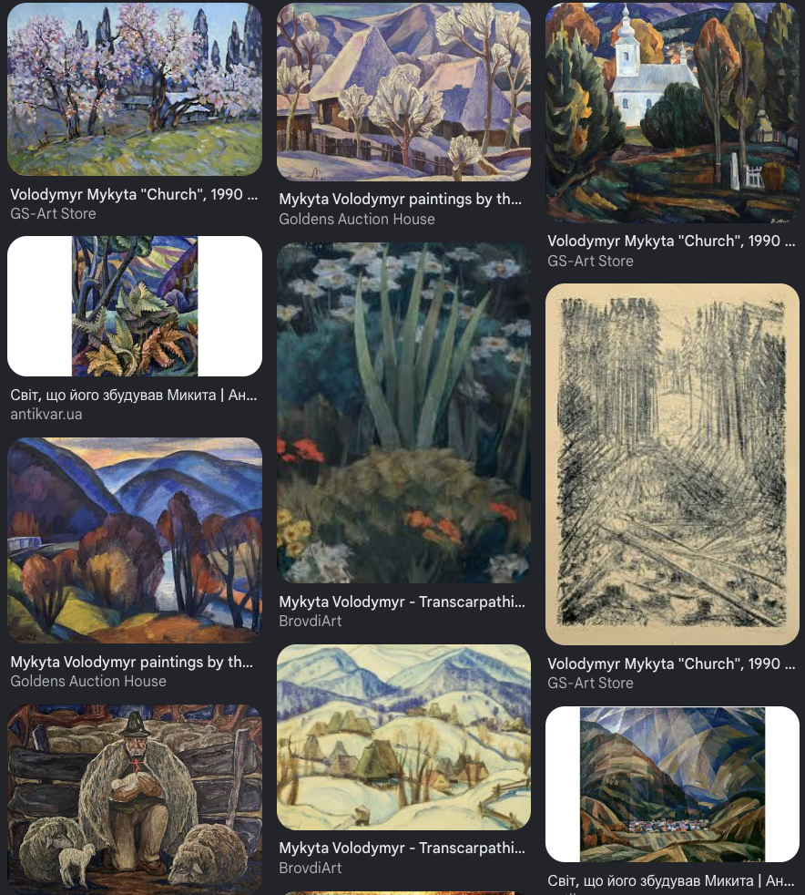

# 07_05: External Stakeholders Registry — B2G/B2B & Cultural Layer

## 🎯 Мета

Зареєструвати **зовнішні залежності адміністративного та інфраструктурного
рівня**, які потрібні для:

1. **Легального розгортання** Soldier-анкерів та Queen-шлюзів у державних
   лісах України (Лісовий кодекс, ПЗФ, кадастр).
2. **B2B-продажу** SCC/SFC ([`05_03`](05_03_Tokenomics_SCC_and_SFC)),
   параметричного страхування та підписки на API-доступ
   ([`07_02`](07_02_Nature_as_a_Service_Contracts), [`07_03`](07_03_Unit_Economics_and_BOM)).
3. **Польових операцій** — масштабне розгортання тисяч анкерів силами
   мобілізованої команди (логістика, безпека, перекваліфікація).
4. **Сертифікації та метрології** як юридичної основи токенізації.

Документ — це об'єднаний **Social API Registry**: **Частина A** (нижче §1–§8) — B2G/B2B адміністративно-інфраструктурні стейкхолдери; **Частина B** (§9–§15) — **Культурний шар** (митці, журналісти, диригенти, народні майстри), що транслює сирі D-MRV-цифри у людську емпатію (влито з колишнього 04_07). Жоден запис не блокує production-merge, жоден не в hot-path. Принцип Zero-Trust: матриця інтерфейсів замість художніх есеїв.

---

## ✅ Статус

- **Поточний TRL:** Conceptual (TRL 1) — outreach pool без активних
  контрактів. Лише іменовані особи з верифікованою публічною посадою.
- **Trigger для активації:**
  - **Tier 1 (Legal & Land Shield):** до моменту першого live анкера в
    державному лісі (зараз — TRL 4-5 у [`01_01`](01_01_Coaxial_Gyroid_Topology_and_PEEK)).
  - **Tier 2-3 (Infrastructure / B2B):** до моменту першої SCC-емісії
    в production ([`05_02`](05_02_Proof_of_Growth_Pipeline)).
- **Власник:** TBD (CEO / Head of Partnerships).
- **Outreach tracker:** [`00_07`](00_07_Action_Plan_Tracker) § External Stakeholders.

---

## 🔗 Cross-references

| Ресурс | Зв'язок |
|---|---|
| [04_04_Phlex_UI_and_Tailwind](04_04_Phlex_UI_and_Tailwind) | Design tokens, типографіка (Частина B — Культурний шар) |
| [04_05_Codex_Lore_Module](04_05_Codex_Lore_Module) | Codex Lore — наративний субстрат (Частина B) |
| [05_03_Tokenomics_SCC_and_SFC](05_03_Tokenomics_SCC_and_SFC) | Токеноміка, CBAM offset |
| [07_02_Nature_as_a_Service_Contracts](07_02_Nature_as_a_Service_Contracts) | B2B/B2C контракти, SLA (§2) |
| [07_03_Unit_Economics_and_BOM](07_03_Unit_Economics_and_BOM) | Unit economics за tier |
| [07_04_Grant_Applications_Tracker](07_04_Grant_Applications_Tracker) | Horizon Europe pipeline |
| [08_01_University_R_and_D_Protocols](08_01_University_R_and_D_Protocols) | §1.4 Кирилюк — ректорський парасоль |
| [08_05_CHIPB_Fire_Safety_Integration](08_05_CHIPB_Fire_Safety_Integration) | ДСНС partner cluster |
| [08_07_SEU_Economics_and_Legal_Integration](08_07_SEU_Economics_and_Legal_Integration) | §1.3 Аблязов — legal wrapper |
| `08_03` / `08_04` / `08_06` | глибокі академ./stakeholder профілі (SSOT — тут лише cross-link) |
| `02_05` / `03_04` | LoRa висотні точки / Lorenz stress-аналіз |
| [00_07_Action_Plan_Tracker](00_07_Action_Plan_Tracker) | § External Stakeholders (UNI.x, BIZ.x) |

## 📑 Зміст

<!-- TOC:AUTO:START -->
- [Архітектурні правила (фіксоване)](#-архітектурні-правила-фіксоване)
- [1. Чотиритирна архітектура](#1-чотиритирна-архітектура)
- [2. Tier 1 — Legal & Land Shield (Без цього проєкт не може існувати)](#2-tier-1--legal--land-shield-без-цього-проєкт-не-може-існувати)
- [3. Tier 2 — Infrastructure & Field Operations](#3-tier-2--infrastructure--field-operations)
- [4. Tier 3 — Certification & Metrology](#4-tier-3--certification--metrology)
- [5. Tier 4 — B2B Customers (Revenue Side)](#5-tier-4--b2b-customers-revenue-side)
- [6. Tier 5 — Social Inclusion (EU Grants Pathway)](#6-tier-5--social-inclusion-eu-grants-pathway)
- [7. Tier 6 — Низькопріоритетні / Опціональні залежності](#7-tier-6--низькопріоритетні--опціональні-залежності)
- [8. Принципи Соціальної Архітектури](#8-принципи-соціальної-архітектури)
- [9. Культурний шар — Архітектурні правила (фіксоване)](#-9-культурний-шар--архітектурні-правила-фіксоване)
- [10. Стратегічна функція Культурного Шару](#10-стратегічна-функція-культурного-шару)
- [11. Stakeholder Matrix (Культурний шар)](#11-stakeholder-matrix-культурний-шар)
- [12. Концепція: Genesis NFT (deferred → 05_03 Phase 6+)](#12-концепція-genesis-nft-deferred--05_03-phase-6)
- [13. Концепція: Data Sonification (deferred → TRL 8-9)](#13-концепція-data-sonification-deferred--trl-8-9)
- [14. Концепція: Codex Realm Population](#14-концепція-codex-realm-mythos-population)
- [15. Філософське обґрунтування (Культурний шар)](#15-філософське-обґрунтування-культурний-шар)
<!-- TOC:AUTO:END -->

---

## 🛑 Архітектурні правила (фіксоване)

1. **Без B2G-фічей у hot-path:** запити з urgent priority (наприклад,
   доступ до API від ДСНС/ОДА) ходять через існуючі публічні ендпоінти
   ([`04_03`](04_03_REST_API_v1_Reference)) з ролевим RBAC. Жодних дедикованих
   воркерів для зовнішніх стейкхолдерів у `uplink`/`alerts`/`critical`/
   `downlink`/`web3_critical` чергах.
2. **Жодних усних домовленостей:** будь-яка повідомленість сторонньому
   стейкхолдеру про "ми будемо…" має бути попередньо підписана
   [`08_07 §1.3 Аблязов`](08_07_SEU_Economics_and_Legal_Integration) як
   legal exposure.
3. **B2G ризики — окремий threat-model:** доступ держслужбовців у
   `data/exports` обмежується контрактом про не-розкриття; жоден B2G
   stakeholder не отримує `super_admin` ролі в Rails API.
4. **CBAM / SCC compliance:** будь-яке твердження клієнту про
   "офсет CO₂" вимагає попередньої метрологічної сертифікації — див.
   §3 нижче (Чорней).

---

## 1. Чотиритирна архітектура

Зовнішні залежності організовані за **вектором ризику** для проєкту:

```
Tier 1: Legal & Land Shield      ─┐
                                   │ Без цього не можна
Tier 2: Infrastructure & Field Ops ┤ розгорнути жодного
                                   │ анкера у державному лісі
Tier 3: Certification & Logistics ─┘

Tier 4: B2B Customers             ─┐  Це rev-side —
                                   │  активується після
Tier 5: Social Inclusion (EU)     ─┘  TRL 7 в Модулі 05
```

---

## 2. Tier 1 — Legal & Land Shield (Без цього проєкт не може існувати)

Гейткіпери фізичної інсталяції в державному лісі. Підписи цих людей
розблокують доступ до Черкаського бору.

### 2.1. Олександр Миколайович Дзюбенко — Лісівник + Економіст + ЧДТУ

- **Звання:** Заслужений лісівник України (2015).
- **Посада:** Директор Центрального лісового офісу ДП "Ліси України"
  (керує всіма державними лісами Черкащини, включно з Черкаським бором).
- **Науковий ступінь:** Доктор економічних наук.
- **Академічна афіліація:** Професор кафедри лісового господарства та
  раціонального природокористування **ЧДТУ** (за сумісництвом — тобто
  органічно вписаний у консорціум [`08_04`](08_04_CHDTU_Data_Science_Collaboration)).
- **API In (для Silken Net):**
  - Договір про створення експериментального наукового полігону на базі
    лісгоспу — обхід багаторічної бюрократії з оформленням анкерів.
  - Розмова бізнес-мовою: ROI від превенції пожеж + продаж SCC як
    додаткове джерело прибутку для ДП.
  - Адмінмост між ДП "Ліси України" та ЧДТУ — спільні гранти.
- **API Out (для нього):**
  - Діджиталізація ДП — інструмент моніторингу не зрубаного, а *живого*
    лісу в реальному часі. Кар'єрний плюс для топ-менеджера.
  - Превенція пожеж = особистий "страховий поліс" посади.
  - ESG/FSC-сертифікат для експорту української деревини в ЄС.
- **SSOT-мапінг:** [`01_01`](01_01_Coaxial_Gyroid_Topology_and_PEEK) (legal
  install), [`05_03`](05_03_Tokenomics_SCC_and_SFC) (DP "Ліси" як SCC-holder),
  [`08_04`](08_04_CHDTU_Data_Science_Collaboration) (cross-ref CHDTU).
- **Status:** 🔵 Identified (highest-priority B2G contact).

### 2.2. Юрій Юрійович Сегеда — Природоохоронець + Геронимівка

- **Звання:** Заслужений природоохоронець України (2020).
- **Посада:** Директор ДП "Смілянське лісове господарство" (Smilyansky LH
  межує з Черкасами і є частиною єдиного лісового масиву).
- **Бекграунд:** Багато років головний лісничий "Черкасиліс" та Черкаського
  лісгоспу. Проживає в **с. Геронимівка** — буквально серце Черкаського
  бору та найближча точка до потенційного полігону Genesis-кластера.
- **API In:**
  - Експертний еко-аудит проєкту: офіційний висновок щодо біосумісності
    LoRaWAN-радіо та CODIT-протоколу ([`01_04`](01_04_CODIT_and_Xylemointegration)).
  - Доступ до особливо цінних заказників Смілянщини — наступний крок
    розширення після Черкаського бору.
  - Експертний edvisor DAO для Proof of Growth: підтвердження кореляції
    `z_value` ([`03_04`](03_04_mruby_Lorenz_Attractor)) з реальним станом екосистеми.
- **API Out:**
  - "Кібер-охоронці" сліпих зон заповідних територій.
  - Predictive fire prevention через `delta_t` критичного водного стресу.
  - Двері до європейського еко-фінансування для лісгоспу.
- **SSOT-мапінг:** [`01_04`](01_04_CODIT_and_Xylemointegration), [`05_02`](05_02_Proof_of_Growth_Pipeline)
  (oracle validation), [`08_05`](08_05_CHIPB_Fire_Safety_Integration)
  (fire-safety overlap).
- **Status:** 🔵 Identified (highest-priority B2G contact #2).

### 2.3. Землевпорядна експертиза — Кадастр + RWA (TBD-Identified)

- **Звання:** Заслужений землевпорядник України.
- **Кандидати:** Колишні/діючі керівники Головного управління Держгеокадастру
  у Черкаській області, головні землевпорядники районів, директори
  землеоціночних бюро. **Конкретне ім'я наразі не верифіковано** (Сіроштан
  згадана в попередніх нотатках із застереженням про складну кар'єрну
  історію — потребує перевірки через [`08_07 §1.3 Аблязов`](08_07_SEU_Economics_and_Legal_Integration)).
- **API In:**
  - Сервітут / мікро-договір оренди (1×1 м) під Queen-щоглу — щоб через
    рік прокуратура не змусила демонтаж.
  - Кадастрові дані → Oracle для смарт-контрактів: координати + правовий
    статус ділянки автоматично підшиваються до RWA-токена.
  - Грошова оцінка гектара лісу до/після підписки → фінансовий
    аргумент для B2B-продажів.
- **API Out:**
  - 3D-кадастр з IoT-моніторингом ґрунтових вод + ерозії.
  - Дані як доказ у земельних/екологічних судах (незаконна вирубка,
    підпал).
- **SSOT-мапінг:** [`05_02`](05_02_Proof_of_Growth_Pipeline) (RWA oracle),
  [`07_02`](07_02_Nature_as_a_Service_Contracts) (Land contracts).
- **Status:** ⚪ Conceptual — потрібна верифікація імені перед outreach.

### 2.4. Юридична броня — Legal Wrapper для SCC (TBD)

- **Звання:** Заслужений юрист України.
- **Кандидати:** Колишні судді апеляційних судів, екскерівники обласної
  юстиції, топ-адвокати, професура **ННІ економіки і права ЧНУ** —
  доступ через [`08_01 §1.4 Кирилюк`](08_01_University_R_and_D_Protocols)
  (директор ННІ + в.о. ректора). Тут резонує також з
  [`08_07 §1.3 Аблязов Денис`](08_07_SEU_Economics_and_Legal_Integration)
  — він закриває RWA-правову архітектуру.
- **API In:**
  - **Лісовий кодекс компатибільність:** перекласифікація Soldier-анкера
    з "втручання в держмайно" на "науково-вимірювальний прилад для
    моніторингу загрози пожеж". Це усуває статтю про умисне псування.
  - **RWA Legal Wrapper:** структура DAO (Цуг/Вайомінг) + договір
    еко-концесії з місцевою громадою — кросс-юрисдикційний міст.
  - **IP захист:** патенти на геометрію анкера ([`01_01`](01_01_Coaxial_Gyroid_Topology_and_PEEK)),
    EBFC ([`01_03`](01_03_EBFC_Enzymatic_Bio_Fuel_Cell)), bio-contract
    ([`03_04`](03_04_mruby_Lorenz_Attractor)).
- **API Out:**
  - "Блакитний океан" Cyber-Ecological Law: піонер у Web3/Eco-Law
    в Україні.
  - Високомаржинальний B2B-консалтинг (CBAM, ESG-арбітраж).
- **SSOT-мапінг:** [`08_03`](08_03_Joint_Publications_and_IP_Strategy)
  (IP strategy), [`08_07 §1.3`](08_07_SEU_Economics_and_Legal_Integration)
  (RWA legal architecture).
- **Status:** 🟡 Outreach (через СЄУ — Аблязов уже залучений).

---

## 3. Tier 2 — Infrastructure & Field Operations

### 3.1. ДСНС / Цивільний захист — крос-ref [`08_05`](08_05_CHIPB_Fire_Safety_Integration)

- **Звання:** Заслужений працівник цивільного захисту України.
- **Інституційний якор:** ЧІПБ ім. Героїв Чорнобиля + ДСНС обласна
  служба. Партнер уже залучений через 5 окремих контактів у
  [`08_05`](08_05_CHIPB_Fire_Safety_Integration) (§1.1 Биченко, §1.2 Ротар,
  §1.3 Куліца, §1.4 Зобенко, §1.5 Несен).
- **Нове API (понад уже описане в 08_05):**
  - Доступ до тренувальних полігонів ЧІПБ для контрольованих вогневих
    випробувань Queen-капсули.
  - Державна сертифікація алгоритмів виявлення температурних аномалій
    як офіційного протоколу реагування → переводить Silken Net у
    "систему держрівня".
- **SSOT-мапінг:** [`08_05`](08_05_CHIPB_Fire_Safety_Integration) (primary),
  [`03_03`](03_03_TinyML_Acoustic_Inference) (chainsaw + thermal),
  [`07_02`](07_02_Nature_as_a_Service_Contracts) (parametric insurance trigger).
- **Status:** 🟢 Engaged (через ЧІПБ — Несен Іван активний).

### 3.2. Енергетика (ПАТ "Черкасиобленерго" + Укрзалізниця ЛЕП) — ЛЕП-моніторинг

- **Звання:** Заслужений енергетик України (TBD конкретне ім'я).
- **API In:**
  - Експертиза грозо- та EMI-захисту Queen-шлюзу.
  - Доступ до висотних точок (опори ЛЕП у Черкаському борі) для розгортання
    LoRaWAN-покриття 15 км.
- **API Out (комерційна цінність — велика):**
  - **Predictive ЛЕП-pruning** як підписка SLA: система за тиждень
    вкаже на конкретні 5 дерев уздовж 10 км лінії, які впадуть під
    наступним сильним вітром (через `z_value` + гіро-аналіз стовбура,
    [`03_04`](03_04_mruby_Lorenz_Attractor)). Замість гектарних вирубок
    — точкове видалення. Економія мільйонів грн + еко-PR.
- **SSOT-мапінг:** [`02_05`](02_05_Queen_Hardware_and_Starlink) (LoRa
  висотні точки), [`07_02 §2 SLA`](07_02_Nature_as_a_Service_Contracts) (B2B
  subscription).
- **Status:** ⚪ Conceptual.

### 3.3. Транспорт (ПрАТ "Черкасиавтотранс", Укрзалізниця) — мобільні LoRa-шлюзи

- **Звання:** Заслужений працівник транспорту України (TBD).
- **API In:**
  - **Мобільні Queen на колесах:** встановлення LoRa-шлюзів на приміські
    автобуси/потяги, що щодня перетинають Черкаський бір. Кожен прохід
    "збирає" пакети з тисяч Soldier — кардинально здешевлює статичну
    інфраструктуру.
  - Експертиза віброзахисту електроніки (low/high freq) для PCB-anchor
    на дереві, що розгойдується.
  - Supply chain для масштабованого розгортання (50K анкерів у Карпатах).
- **API Out:**
  - **SLA Service-of-Roads** для Укравтодор/Укрзалізниці: predictive
    падіння дерев на трасу Н-16, залізничну гілку Сміла.
  - "Zero Carbon Logistics" статус через купівлю SCC.
  - Захист берегозахисних лісосмуг Дніпра (для річкового порту).
- **SSOT-мапінг:** [`02_05`](02_05_Queen_Hardware_and_Starlink) (mobile gateway
  variant), [`07_02`](07_02_Nature_as_a_Service_Contracts) (SLA tier).
- **Status:** ⚪ Conceptual.

### 3.4. Комунальні служби (КП "Дирекція парків", "Укртелеком") — Urban Forestry

- **Звання:** Заслужений працівник сфери послуг України.
- **API In:**
  - Доступ до муніципальних дахів і веж Черкас для LoRaWAN-покриття
    городянних зон (мікрорайон Соснівка, парк "Сосновий бір").
  - Експертиза SLA та диспетчерських служб 24/7.
- **API Out:**
  - **Захист від муніципальних позовів** за впалі дерева в парках —
    predictive аналітика аварійних стовбурів.
  - Оптимізація міського поливу за `delta_t` гідратації ксилеми →
    економія води/електроенергії для бюджету міста.
- **SSOT-мапінг:** [`07_02`](07_02_Nature_as_a_Service_Contracts) (Urban
  Forestry tier), [`05_02`](05_02_Proof_of_Growth_Pipeline) (municipal
  RWA).
- **Status:** ⚪ Conceptual (Urban Forestry deferred → post-Genesis-cluster).

### 3.5. Польова логістика (емерджентна медицина) — Field Kit Hardening

- **Особа:** Віталій Осіпов — Заслужений працівник охорони здоров'я України
  (Указ Президента від 01.01.2026); 30+ років у службі реагування на НС.
- **API In:**
  - Field Kit hardening для інженерів Silken Net: швидке розгортання в
    лісі без доріг, у дощ/холод; протокол евакуації при аваріях.
  - Знання географії бездоріжжя Черкащини на рівні навігатора.
- **SSOT-мапінг:** [`08_05`](08_05_CHIPB_Fire_Safety_Integration) (Field Ops),
  [`02_05`](02_05_Queen_Hardware_and_Starlink) (Queen deployment).
- **Status:** 🔵 Identified.

---

## 4. Tier 3 — Certification & Metrology

### 4.1. Микола Чорней — ДП "Черкасистандартметрологія"

- **Звання:** (підлягає верифікації — кандидат на Заслужений метролог)
- **Посада:** Багаторічний керівник ДП "Черкасистандартметрологія" —
  обласне держпідприємство з еталонної бази та повірки.
- **API In:**
  - **Сертифікація Soldier як засобу вимірювальної техніки:** внесення
    в державний реєстр. Без цього SCC = "цифри з інтернету"; з цим =
    юридичний факт для CBAM та європейських покупців.
  - **Дрейф-компенсація:** математичні моделі самокалібрування для
    20-річного horizon — sensors не "пливуть".
  - **Аудит сумарної похибки D-MRV:** доказ < 2-3% похибки мережі з
    1000 датчиків.
- **API Out:**
  - Перехід галузі від аналогової повірки до IoT-метрології 4.0.
  - Канал у BIPM / OIML з інноваційними доповідями.
- **SSOT-мапінг:** [`05_02`](05_02_Proof_of_Growth_Pipeline) (D-MRV
  certification), [`05_03`](05_03_Tokenomics_SCC_and_SFC) (SCC юридичний
  статус для CBAM).
- **Status:** 🔵 Identified.

---

## 5. Tier 4 — B2B Customers (Revenue Side)

> Активуються тільки після TRL 7 у [`05_02`](05_02_Proof_of_Growth_Pipeline)
> (live SCC mint). Зараз — фіксуємо потенційну воронку.

### 5.1. Аграрний сектор (МХП, Кернел, LNZ Group, СТОВ Черкащини)

- **Звання:** Заслужений працівник сільського господарства України.
- **Іменований приклад:** Петро Душейко (один із керівників успішних
  СТОВ; ім'я з відкритих регіональних довідників).
- **API In:**
  - **Лісосмуги як перший комерційний полігон:** не дикий бір, а штучні
    полезахисні смуги. Аграрії знають: висихання лісосмуги = −15-20%
    врожаю. Перші платоспроможні B2B-клієнти.
  - Елеватори (60м) як ідеальні LoRaWAN-вишки (15-20 км покриття).
  - Прямі інвестиції (ангельський раунд) до виходу на європейські фонди.
- **API Out:**
  - **Дерево як глибинний сенсор ґрунтових вод 5-10 м** — найранішній
    сигнал ґрунтової посухи (стара сосна з глибоким коренем чує посуху
    раніше за класичні агро-датчики 30-50 см).
  - Сертифікат біорізноманіття (Z-value oracle) → дешевші кредити в
    європейських банках.
  - Власна емісія SCC з своїх лісосмуг.
- **SSOT-мапінг:** [`07_02`](07_02_Nature_as_a_Service_Contracts) (Agro tier),
  [`05_03`](05_03_Tokenomics_SCC_and_SFC) (Agro-mint sub-DAO).
- **Status:** ⚪ Conceptual.

### 5.2. Хімічна промисловість (ПрАТ "Азот") — CBAM offset

- **Звання:** Заслужений працівник промисловості України.
- **Іменовані приклади:** Іван Кухоль (начальник відділення цеху "Азот"),
  Олексій Хуторний (старший апаратник абсорбції).
- **API In:**
  - **Масштабування хімії:** перенос синтезу осмієвого полімеру/EBFC
    каталізаторів з лабораторного об'єму ([`08_06`](08_06_CHMA_Biomedical_Integration))
    в промислові реактори. Зараз — критичний gap між R&D і виробництвом.
  - Прискорене старіння Ti-6Al-4V у промислових хімічних камерах
    ("Азот" має камери з NH₃/HNO₃ під тиском — ідеально для
    20-year accelerated aging тесту).
  - Прямий вихід на CFO/власників заводу — головний B2B-міст.
- **API Out:**
  - **EU CBAM offset:** "Азот" експортує добрива в ЄС → платить
    CBAM-податок мільйонами. SCC = легальний офсет CO₂ → економія
    податку. Найперший великий B2B-клієнт SCC.
  - **Кавітаційний моніторинг трубопроводів:** ті самі акустичні
    алгоритми ([`03_03`](03_03_TinyML_Acoustic_Inference)), що для лісу,
    адаптовані для magistral pipes — готовий spin-off.
- **SSOT-мапінг:** [`01_03`](01_03_EBFC_Enzymatic_Bio_Fuel_Cell) (chem
  scale-up), [`05_03`](05_03_Tokenomics_SCC_and_SFC) (CBAM offset),
  [`03_03`](03_03_TinyML_Acoustic_Inference) (industrial spinoff).
- **Status:** 🔵 Identified.

### 5.3. Туризм — RWA-сувеніри B2C

- **Звання:** Заслужений працівник туризму України (TBD).
- **API In:**
  - **Розгортання B2C-каналу через турфірми:** туристи на екостежках
    мінтять NFT конкретного 100-річного дуба (cross-ref [`07_05`](07_05_External_Stakeholders_Registry)
    Genesis NFT).
  - "Амбасадори безпеки" — гіди пояснюють групам, що Queen-шлюзи це
    не "вишки 5G", антивандальний щит.
- **API Out:**
  - **Smart Forest AR-додатки** — туристичний продукт європейського
    рівня (deferred → TRL 9).
  - "Carbon Neutral Resort" сертифікація для готелів Соснівки.
  - SLA на безпеку рекреаційних зон.
- **SSOT-мапінг:** [`05_03`](05_03_Tokenomics_SCC_and_SFC) (B2C mint),
  [`07_02`](07_02_Nature_as_a_Service_Contracts) (Resort tier).
- **Status:** ⚪ Conceptual.

### 5.4. Архітектори та забудовники — Urban Smart City

- **Звання:** Заслужений архітектор України + Заслужений будівельник України.
- **API In:**
  - Інтеграція Silken Net у генплани нових еко-парків Черкас + регіону.
  - Експертиза антивандальних корпусів у міському середовищі.
- **API Out:**
  - **ESG-преміум для ЖК-проєктів:** LEED/BREEAM сертифікати через
    підключення дерев на території до Silken Net.
  - Параметричне страхування крупномірних насаджень (NaaS).
- **SSOT-мапінг:** [`07_02`](07_02_Nature_as_a_Service_Contracts) (Urban tier),
  [`02_05`](02_05_Queen_Hardware_and_Starlink) (urban radome).
- **Status:** ⚪ Conceptual (Urban tier deferred).

### 5.5. Ветеринарна служба + Агрохолдинги — Біобезпека

- **Звання:** Заслужений працівник ветеринарної медицини України.
- **API In:**
  - Розширення TinyML моделі ([`03_03`](03_03_TinyML_Acoustic_Inference))
    на дикі звуки (короїд, кабани/АЧС) — wildlife acoustic inference.
  - Доступ через головних ветеринарів агрохолдингів на санітарно-захисні
    лісосмуги великих ферм/птахофабрик.
- **API Out:**
  - Епідеміологічне прогнозування вектор-інфекцій через мікроклімат
    лісу.
  - **EU Deforestation Regulation compliance:** доказ моніторингу лісів
    у супровідних документах експорту м'яса/птиці.
- **SSOT-мапінг:** [`03_03`](03_03_TinyML_Acoustic_Inference) (multi-class
  extension), [`07_02`](07_02_Nature_as_a_Service_Contracts) (Agro biosafety).
- **Status:** ⚪ Conceptual.

---

## 6. Tier 5 — Social Inclusion (EU Grants Pathway)

> Не для revenue — для **Horizon Europe Social Impact Score**. Без цього
> компоненту deep-tech IoT-стартап не отримає 5M+ EUR гранти ЄС.

### 6.1. Галина Михайлівна Кучер — Соціальна сфера + DAO ком'юніті

- **Звання:** Заслужений працівник соціальної сфери України; кпн (педагогіка);
  5 скликань депутатка Черкаської обласної ради; громадська діячка.
- **API In (для Silken Net):**
  - **Соціальна інклюзія Horizon Europe:** інтеграція ветеранів /
    людей з інвалідністю у складання Queen-шлюзів та моніторинг
    дашбордів. Це піднімає grant-пріоритет у Cluster 6 / Cluster 4.
  - **Кадровий резерв для масштабування:** цільові програми
    перекваліфікації через центри зайнятості — держбюджет оплачує
    робочу силу для розгортання тисяч анкерів.
- **API Out:**
  - **Eco-Therapy 4.0** — інноваційні смарт-маршрути для реабілітації
    ветеранів з ПТСД у Черкаському борі. Пацієнт відкриває додаток біля
    дерева → бачить "пульс" (`delta_t`) → синхронізація з природними
    ритмами. Перший у світі інструмент цифрової лісотерапії.
  - "Green Collar Jobs" — престижні робочі місця для людей після криз.
- **SSOT-мапінг:** [`07_04`](07_04_Grant_Applications_Tracker) (Horizon Europe
  Cluster 4 — Inclusiveness; Cluster 6 — Bioeconomy), [`04_04`](04_04_Phlex_UI_and_Tailwind)
  (mobile Eco-Therapy module — deferred).
- **Status:** 🔵 Identified.

### 6.2. Заслужений шахтар + Just Transition (ВПО зі Сходу)

- **Звання:** Заслужений шахтар України.
- **Профіль:** Сьогодні носії звання в Черкасах — переважно ВПО зі Сходу
  України, ветерани вугільної галузі або старі фахівці з видобутку торфу
  (Ірдинське торфопідприємство).
- **API In:**
  - **EU Just Transition наратив:** "Ті, хто вчора діставав вуглець
    з-під землі — сьогодні рятують ліс". Відкриває спеціальні бюджети
    European Green Deal Just Transition Fund.
  - **Підземна телеметрія Ірдинського торфу:** торф горить *під землею*
    місяцями. Шахтарі — найкращі у світі фахівці з підземних газів
    (метан, CO) та геотермальних сенсорів. Модифікація анкера: ground
    variant для раннього виявлення торф'яних пожеж.
- **API Out:**
  - Новий сенс і соціальна адаптація — престижна "зелена" робота.
- **SSOT-мапінг:** [`07_04`](07_04_Grant_Applications_Tracker) (Just Transition
  Fund), [`03_03`](03_03_TinyML_Acoustic_Inference) (subterranean variant
  — deferred), [`08_05`](08_05_CHIPB_Fire_Safety_Integration) (peat fire
  early warning).
- **Status:** ⚪ Conceptual (high social-PR value, no individual contact yet).

### 6.3. Спортивна школа — Field Operations Squad

- **Звання:** Заслужений працівник фізичної культури і спорту України.
- **Іменовані приклади:** Наталія Стороженко (директорка ШВСМ), Володимир
  Іваненко (ветеран-чемпіон), Леонід Сіренко (функціонер при ННІ фіз.
  культури ЧНУ).
- **API In:**
  - **Польова команда інсталяції:** студенти-спортсмени ЧНУ + випускники
    ШВСМ як літня практика. Витривалі, дисципліновані, доступні через
    канал alumni.
  - **Спортивний ESG-маркетинг:** трейл-забіги/стрітбол у Черкаському
    борі з конвертацією внесків у SCC. Безкоштовний buildup DAO-ком'юніті.
- **API Out:**
  - Онлайн-дашборд мікроклімату бору для прокладання кардіо-маршрутів.
- **SSOT-мапінг:** [`05_03`](05_03_Tokenomics_SCC_and_SFC) (DAO fundraising
  events), [`08_01`](08_01_University_R_and_D_Protocols) (ЧНУ alumni channel).
- **Status:** 🔵 Identified.

---

## 7. Tier 6 — Низькопріоритетні / Опціональні залежності

### 7.1. Фармацевт (Раїса Котикова / викладачі ЧМА) — 8-HQ пролонгована дія

- **Звання:** Заслужений працівник фармації України.
- **Контекст:** Лише якщо валідуватиметься self-healing мікрокапсула
  з 8-гідроксихіноліном для CODIT-захисту ([`01_02`](01_02_Ti_6Al_4V_Metallurgy_and_DMLS),
  [`08_06 §1.5 Глущенко`](08_06_CHMA_Biomedical_Integration)). 8-HQ
  має виділятися 5 років без вимивання — задача фармакокінетики.
- **Status:** ⚪ Conceptual — активувати після первинних результатів
  Глущенка в ЧМА.

### 7.2. Заслужений металург / гірник — Industrial Materials

- Можливі точки дотику: DMLS post-processing, hydrogen embrittlement
  тести, рекультивація кар'єрів як SCC-mint sources.
- **Status:** ⚪ Conceptual — переважно покривається існуючими школами
  Мінаєва ([`08_01 §1.1`](08_01_University_R_and_D_Protocols)) та Гусака
  ([`08_01 §1.2`](08_01_University_R_and_D_Protocols)) + ЧДТУ Базіло/Бондаренко
  ([`08_04 §1.3`](08_04_CHDTU_Data_Science_Collaboration)).

### 7.3. Машинобудівник (НВК "Фотоприлад", "Темп") — Серійне виробництво

- **Контекст:** При переході від DMLS-друку 50 шт. до серії 50K шт. через
  лиття за моделями, що випалюються, або багатоосьове фрезерування.
- **Status:** ⚪ Conceptual — активувати на TRL 7-8 в [`01_01`](01_01_Coaxial_Gyroid_Topology_and_PEEK).

### 7.4. Заслужений економіст України

- **Кандидати:** Наталія Джур (колишня директорка Черкаського інституту
  банківської справи НБУ, екон. доктор наук); Олександр Черевко (Заслужений
  економіст, екс-голова ОДА).
- **Status:** ⚪ Conceptual — переважно покривається активним партнером
  Кирилюком ([`08_01 §1.4`](08_01_University_R_and_D_Protocols)) як директором
  ННІ економіки і права ЧНУ та СЄУ-командою Чудаєвої/Ус ([`08_07 §1.1-1.2`](08_07_SEU_Economics_and_Legal_Integration)).
  Залишається advisory pool, без active outreach.

---

## 8. Принципи Соціальної Архітектури

1. **People as External APIs:** Кожен стейкхолдер описаний інтерфейсами,
   не сюжетами. Це не есей про "як було б добре дружити з лісівником",
   а контракт виду `(input, output, fault_mode)`.
2. **Decoupling від hot-path:** Жодна позиція тут не блокує merge коду.
3. **Lazy activation:** Tier 4-5 — це майбутні revenue/grants. Активуються
   тільки після TRL-trigger у відповідних модулях.
4. **Single Source of Truth для зв'язків:** Якщо особа вже описана глибоко
   в 08_*, тут — тільки cross-link, не дубль профілю. Дубль профілю
   зруйнує SSOT.


---

# 🎨 Частина B — Культурний шар (Cultural Layer)

> Влито з колишнього `04_07` при дворівневій реструктуризації 2026-05-30 — культурний шар (митці / журналісти / диригенти / народні майстри) і B2G/B2B тепер єдиний **Social API Registry**. Спільне правило non-hot-path (ADR-CDX-4, [`04_05 §2`](04_05_Codex_Lore_Module)) діє для обох частин.

## 🎨 9. Культурний шар — Архітектурні правила (фіксоване)

1. **Декаплінг від hot-path:** жоден агент Культурного Шару не запускає
   Sidekiq-воркер у чергах `uplink (#1)`, `alerts (#2)`, `critical (#3)`,
   `downlink (#4)`, `web3_critical (#6)`. Будь-який Codex-зв'язаний воркер
   живе в `default (#5)` або `low (#9)` — узгоджено з ADR-CDX-4 у
   [`04_05 §2`](04_05_Codex_Lore_Module).
2. **NFT/RWA — тільки після MoU:** будь-який Genesis NFT з прив'язкою
   до конкретного митця вимагає підписаного угоди про використання імені
   (`Name & Likeness Release`) — це підлягає [`08_07 §1.3 Аблязов`](08_07_SEU_Economics_and_Legal_Integration)
   до затвердження.
3. **Codex Realm `mythos` — не "автобіографія":** статті в `codex_nodes`,
   що цитують зовнішніх осіб, мають проходити через `Codex::MarkdownRenderer`
   sanitizer ([`04_05` ADR-CDX-5](04_05_Codex_Lore_Module)).

---

## 10. Стратегічна функція Культурного Шару

Кіберфізичний D-MRV генерує **сирі цифри** (`delta_t`, `z_value`,
`growth_points`). Звичайна людина (інвестор, регулятор ЄС, місцева громада)
не реагує на таблиці БД — вона реагує на **символи**. Культурний Шар —
інтерфейс між машинним кодом лісу та людською емпатією.

Три канали трансляції:

| Канал | Артефакт | Технічна прив'язка |
|---|---|---|
| **Візуальний** | Genesis NFT-колекція, типографіка UI, гравіювання на PEEK-куполах | [`05_03`](05_03_Tokenomics_SCC_and_SFC), [`04_04`](04_04_Phlex_UI_and_Tailwind), [`01_01`](01_01_Coaxial_Gyroid_Topology_and_PEEK) |
| **Аудіо** | Data Sonification — атрактор Лоренца як партитура | [`03_04`](03_04_mruby_Lorenz_Attractor), TRL 8+ |
| **Наративний** | Документальні фільми, PR-сюжети, Codex Discoveries | [`04_05`](04_05_Codex_Lore_Module) (Codex Lore), Phase 6+ |

---

## 11. Stakeholder Matrix (Культурний шар)

### 2.1. Tier A — Cherkasy Cultural Anchor (локальна команда)

Митці з прямим зв'язком із Черкаським Genesis-кластером (Черкаський бір).
Пріоритет вищий: вони фізично доступні для пленерів, обговорень дизайну
PEEK-куполів, антивандальної біомімікрії.

#### A1. Микола Бабак — Концептуальний архів

- **Звання:** Народний художник України.
- **"Код":** Працює парою з дружиною Оленою Бабак ("Babak Couple") у режимі
  концептуальної інсталяції. Десятиліттями збирав українську старовину
  (рушники, ікони на склі, килими) — фактично побудував приватний
  етнографічний архів. Куратор українського павільйону на Венеційській
  бієнале (українські куратори/художники).
- **Резонанс із Silken Net:** Його методологія — *анонімна спадщина як
  arts object* — це той самий принцип, що й Filecoin/IPFS у Рівні 8 нашої
  архітектури: розподілений, нечасовий, time-resistant архів. Бабак може
  концептуально оформити Черкаський бір як "живий архів спадщини".
- **SSOT-мапінг:** [`04_05`](04_05_Codex_Lore_Module) (Realm `mythos`),
  [`05_04`](05_04_Ethereum_L1_State_Anchor) (state anchor як "цифровий курган").
- **Status:** 🔵 Identified.

#### A2. Олександра Теліженко — Етнодизайн та мережевий патерн

- **Звання:** Народний художник України, етнодизайн і монументальне мистецтво.
- **"Код":** Працює в традиції родинної мистецької резиденції в с. Сахнівка
  (Корсунь-Шевченківський район — фактично всередині території розширеного
  Черкаського лісового масиву). Орнаментальна мова — переплетення
  традиційних українських мотивів з сучасним графічним дизайном.
- **Резонанс із Silken Net:** Сама назва *Silken Net* — текстильна метафора;
  mesh-топологія LoRa-вузлів, що обплітає бір, є цифровим аналогом
  рушника-оберега. Орнаментальний переклад топології → національний
  патерн-бренд.
- **SSOT-мапінг:** [`04_04`](04_04_Phlex_UI_and_Tailwind) (Phlex UI motifs),
  [`02_05`](02_05_Queen_Hardware_and_Starlink) (Queen radome graphics).
- **Cross-link:** вже зафіксована як **активний UX-партнер** у
  [`08_07 §1.7`](08_07_SEU_Economics_and_Legal_Integration). Active outreach
  ведеться через СЄУ-MoU; запис тут — для координації Genesis NFT треку.
- **Status:** 🟡 Outreach (через СЄУ).

#### A3. Віктор Афонін — UI/UX та гравіювання капсули

- **Звання:** Заслужений художник України; графічний дизайн.
- **"Код":** Викладає в ЧНУ; роботи в галузі книжкового дизайну, плакату
  та фірмового стилю. Школа Афоніна готує наступне покоління українських
  графічних дизайнерів.
- **Резонанс із Silken Net:** Прямий брендинг — логотип, типографіка
  дашбордів, та (критично) **дизайн гравіювання PEEK-куполів** Soldier-
  капсули. PEEK-радом видимий тільки в момент інсталяції — тож гравіювання
  виконує роль японського *йорісіро* (символ присутності духа).
- **SSOT-мапінг:** [`04_04`](04_04_Phlex_UI_and_Tailwind),
  [`01_01 §3 PEEK`](01_01_Coaxial_Gyroid_Topology_and_PEEK),
  [`02_02`](02_02_Blind_Mate_Pogo_Pin_Interface).
- **Status:** 🔵 Identified.

#### A4. Іван Бондар — Живопис та кераміка з ядра бору

- **Звання:** Народний художник України.
- **"Код":** Народився в с. Яснозір'я — буквально в географічному центрі
  Черкаського бору та Ірдинського болота (полігон IP68-тестів — [`02_05`](02_05_Queen_Hardware_and_Starlink)).
  Майстер кераміки + живопис; усе життя пише ці самі ландшафти.
- **Резонанс із Silken Net:** Як майстер землі та кераміки знає матеріальну
  природу регіону. Може створити фізичні "портрети" Master Nodes —
  керамічні артефакти, які стають фізичним RWA-вираженням токенізованих
  дерев (зворотний міст: цифра → фізика).
- **SSOT-мапінг:** [`05_02`](05_02_Proof_of_Growth_Pipeline) (Master Nodes),
  [`05_03`](05_03_Tokenomics_SCC_and_SFC) (RWA artifacts).
- **Status:** 🔵 Identified.

#### A5. Юрій Іщенко — Монументалізм як еталон спокою

- **Звання:** Заслужений художник України; пейзаж і монументалістика.
- **"Код":** Малює "великі" пейзажі Черкащини у класичній традиції; роботи
  розраховані на сприйняття в архітектурному просторі.
- **Резонанс із Silken Net:** TinyML 5-класифікатор ([`03_03`](03_03_TinyML_Acoustic_Inference))
  потребує візуального + аудіо еталону `IDLE State` для документації та
  пітч-матеріалів. Пейзажі Іщенка — готовий референс гармонійного стану
  лісу (нульова entropy, з якою порівнюються аномалії).
- **SSOT-мапінг:** [`07_02`](07_02_Nature_as_a_Service_Contracts) (NaaS pitch),
  [`03_03`](03_03_TinyML_Acoustic_Inference).
- **Status:** 🔵 Identified.

#### A6. Віктор Олексенко — Гравюра + інженерія

- **Звання:** Народний художник України; гравер по металу і дереву.
- **"Код":** Робота з гравюрою — це по суті prоtoinженерія: точна різьба
  на твердих поверхнях, контрольоване видалення матеріалу.
- **Резонанс із Silken Net:** Серія гібридних відбитків, де радіочастотні
  кола LoRa перетинаються з річними кільцями дерева, — фізичний артефакт,
  який можна дарувати ранніми holders SCC у Genesis-етапі (low-volume
  collector item, не масовий NFT). Plus: вживлення Ti-анкера в ксилему
  — це по суті інженерна гравюра по живому дереву, і його експертиза щодо
  різьби може бути використана у дизайні різьби анкера ([`01_01`](01_01_Coaxial_Gyroid_Topology_and_PEEK)).
- **SSOT-мапінг:** [`05_03`](05_03_Tokenomics_SCC_and_SFC) (collector artifacts),
  [`01_01`](01_01_Coaxial_Gyroid_Topology_and_PEEK).
- **Status:** 🔵 Identified.

#### A7. Тетяна Касьян — Академічний міст ЧНУ

- **Звання:** Заслужений художник України; живопис.
- **"Код":** Багаторічна завідувачка кафедри образотворчого мистецтва
  ЧНУ. Інституціональний доступ до десятків студентів-художників щороку.
- **Резонанс із Silken Net:** Організація мистецьких пленерів у
  Genesis-кластері (Черкаський бір). Студенти створюють "оцифровані"
  портрети конкретних анкерованих дерев — це паралельно навчальний процес
  та інформаційний шум навколо проєкту. Plus: канал для рекрутингу
  cross-faculty (мистецтво × CS) у Silken Net програми стипендій.
- **SSOT-мапінг:** [`08_01`](08_01_University_R_and_D_Protocols) (ЧНУ cross-fac),
  [`04_04`](04_04_Phlex_UI_and_Tailwind).
- **Status:** 🔵 Identified.

#### A8. Максим Гладько — Аукціонна токеноміка та ЗСУ

- **Звання:** Молодший спеціаліст із сучасного дизайну, активний організатор
  благодійних аукціонів на користь ЗСУ.
- **"Код":** Досвід монетизації мистецтва у складних умовах — конвертує
  фізичні арт-об'єкти у грошові потоки для гуманітарних цілей.
- **Резонанс із Silken Net:** Природний міст між фізичним мистецтвом і
  токеномікою. Прецедент: charity-mint — продаж фізичної картини у
  поєднанні з прив'язаним смарт-контрактом на захист конкретного дуба
  у Черкаському борі (Proof of Growth). Кошти йдуть і на ЗСУ, і на наступну
  партію STM32 плат — два соціальні фронти одночасно.
- **SSOT-мапінг:** [`05_03`](05_03_Tokenomics_SCC_and_SFC) (charity-mint),
  [`07_04`](07_04_Grant_Applications_Tracker).
- **Status:** 🔵 Identified.

### 2.2. Tier B — National Visual Identity (PR-валюта)

Митці національного рівня. Залучення доцільне ТІЛЬКИ для Genesis NFT
launch (TRL 8+) або міжнародного пітча (Ethereum Foundation, Horizon
Europe). Не зараз — але треба зафіксувати, доки старша когорта живуть і
працюють.

#### B1. Іван Марчук — Пльонтанізм як mesh-нерв


- **Звання:** Народний художник України; член Світової Золотої Гільдії.
- **"Код":** Винайшов **пльонтанізм** — техніку, де картина складається
  з десятків тисяч переплетених тонких ниток-ліній. Журналом Daily Telegraph
  внесений до списку "100 living geniuses" (2007).
- **Резонанс із Silken Net:** Прямий візуальний переклад mesh-топології
  LoRa. У серії "Trees" (2011 і пізніше) Марчук буквально зображує дерево
  як живу мережу нервів — кожен стовбур розпадається на тисячі ниток,
  які проходять крізь сніг, простір і світло (див. ілюстрації вище).
  Це функціональний аналог нашого LoRa mesh: пакети даних пливуть від
  Soldier до Queen крізь хащі по тисячах переплетених маршрутів.
  Динамічна ШІ-інтерпретація пльонтанізму на основі live-телеметрії =
  найсильніший візуальний бренд мережі.
- **SSOT-мапінг:** [`02_05`](02_05_Queen_Hardware_and_Starlink) (LoRa mesh visual),
  [`04_04`](04_04_Phlex_UI_and_Tailwind) (animated background).
- **Status:** 🔵 Identified (high seniority → priority outreach window).

#### B2. Василь Чебаник — Абетка "Рутенія" як шрифт системи

- **Звання:** Народний художник України; графічний дизайнер, типограф.
- **"Код":** Створив проєкт **"Рутенія"** — оригінальний український
  шрифт, що відновлює "український стиль письма" замість запозиченої
  кириличної форми. Десятиліттями обстоює тезу: українська мова заслуговує
  на власну візуальну ідентичність, не похідну від російської типографіки.
- **Резонанс із Silken Net:** Критична прив'язка до брендингу. Codex Lore
  ([`04_05`](04_05_Codex_Lore_Module)) — це українськомовний наративний
  субстрат; маркування на PEEK-куполах та дашборди повинні
  використовувати "Рутенію" як CSS-fallback, а не системний San Francisco.
  Чебаник дає Silken Net глибинну культурну легітимність.
- **SSOT-мапінг:** [`04_04`](04_04_Phlex_UI_and_Tailwind) (CUSTOM_TEXT_SCALE
  + Web Font), [`04_05`](04_05_Codex_Lore_Module).
- **Status:** 🔵 Identified.

#### B3. Володимир Микита — Закарпатська школа і Карпатський щит



- **Звання:** Народний художник України; патріарх Закарпатської школи живопису.
- **"Код":** Десятиліттями писав старовікові ліси, дерев'яні церкви та
  гірські пейзажі Закарпаття. Один із найстарших активних класиків
  українського живопису (народився 1931 р.).
- **Резонанс із Silken Net:** Коли проєкт вийде за Черкаський полігон в
  Карпати (зона найжорсткішої незаконної вирубки), ім'я Микити стає
  соціальним щитом експансії. Серія "Church" та Карпатські пейзажі
  (див. ілюстрації вище) — це ландшафти, де ліс і людська культура
  співіснують у глибокому історичному зв'язку. TinyML chainsaw-detection
  ([`03_03`](03_03_TinyML_Acoustic_Inference)) буквально захищатиме те,
  що він малював усе життя.
- **SSOT-мапінг:** [`07_02`](07_02_Nature_as_a_Service_Contracts) (regional
  expansion to Carpathians), [`03_03`](03_03_TinyML_Acoustic_Inference).
- **Status:** 🔵 Identified (high seniority → priority outreach window).

#### B4. Віктор Сидоренко — Час, пам'ять, монументальність

- **Звання:** Народний художник України; концептуаліст-монументаліст.
- **"Код":** Куратор українського павільйону на Венеційській бієнале 2003
  з проєктом "Millstones of Time". Працює з темами пам'яті, левітації,
  переходу людини крізь час; роботи деперсоналізовані як архетипи.
- **Резонанс із Silken Net:** [`05_04`](05_04_Ethereum_L1_State_Anchor) —
  щотижневий SHA-256 root в Ethereum mainnet — це філософський концепт
  "вічна пам'ять екосистеми". Сидоренко може створити монументальну
  скульптуру для Genesis-кластера в Черкасах: фізичний об'єкт, на якому
  щотижня викарбовується новий state root (NFC-tag → Etherscan link).
- **SSOT-мапінг:** [`05_04`](05_04_Ethereum_L1_State_Anchor) (anchor monument),
  [`04_05`](04_05_Codex_Lore_Module) (Realm `mythos`).
- **Status:** 🔵 Identified.

#### B5. Любомир Медвідь — Екзистенціал болю як `PANIC_STATE` UI

- **Звання:** Народний художник України; екзистенціаліст львівської школи.
- **"Код":** Складне, часом трагічне мистецтво про межі людського існування,
  біль, мортальність. Глибинно філософське, не декоративне.
- **Резонанс із Silken Net:** Коли датчик фіксує кавітацію
  (дерево висихає) або chainsaw event, це сухі цифри. Візуальна мова
  Медвідя — основа для рендерингу `PANIC_STATE` алертів у дашборді:
  графік падіння Vcap перетворюється на відчуття трагедії. Для ESG-
  інвестора це різниця між "ще один алерт" і "ліс кричить".
- **SSOT-мапінг:** [`04_04`](04_04_Phlex_UI_and_Tailwind) (alert color palette,
  `bg-status-danger`), [`03_03`](03_03_TinyML_Acoustic_Inference).
- **Status:** 🔵 Identified.

#### B6. Феодосій Гуменюк — Холодноярський епос → Master Nodes


- **Звання:** Народний художник України; історичний живопис.
- **"Код":** Малює козаків, гетьманів, ритуали; роботи глибоко вкорінені
  у міфологію Холодного Яру, Суботова, Чигирина. Один з небагатьох
  українських живописців, які системно опрацьовують козацький
  історичний епос. Його полотна потрапляли у видання Cambridge University
  Press — рівень міжнародного академічного визнання.
- **Резонанс із Silken Net:** Genesis-розгортання — у самому серці
  Холодноярської республіки. Дуб Залізняка, монастирські дуби Мотрина
  монастиря — `Legacy Master Nodes` у нашій архітектурі ([`05_02`](05_02_Proof_of_Growth_Pipeline)).
  У його роботах (див. ілюстрації вище) присутні і реліктові дерева, і
  історична символіка — готовий візуальний словник для карток Master Nodes
  у Codex.
- **SSOT-мапінг:** [`05_02`](05_02_Proof_of_Growth_Pipeline) (Master Nodes),
  [`04_05`](04_05_Codex_Lore_Module) (Realm `unique_tree`).
- **Status:** 🔵 Identified.

#### B7. Михайло Гуйда — Українсько-китайський синтез → Wu-Wei

- **Звання:** Народний художник України; працює на стику української
  школи й китайської каліграфії.
- **"Код":** Багато років викладав і виставлявся в Китаї; геніально
  поєднує українську реалістичну школу зі східною каліграфією, легкістю
  та недомовленістю. Один з небагатьох українських митців, які реально
  опанували обидві традиції.
- **Резонанс із Silken Net:** Філософська ДНК проєкту — даоська ("zero
  grid", "спостерігати не втручаючись", живитися від дерева не шкодячи
  йому). Гуйда — художник, який розуміє стан "Між" і може візуалізувати
  атрактор Лоренца ([`03_04`](03_04_mruby_Lorenz_Attractor)) мовою східного
  пензля. Для пітча китайським/південно-східноазіатським інвесторам —
  абсолютний резонанс.
- **SSOT-мапінг:** [`03_04`](03_04_mruby_Lorenz_Attractor),
  [`00_02`](00_02_AI_Native_Engineering_and_TRL) (Wu-Wei filosophy).
- **Status:** 🔵 Identified.

#### B8. Віктор Ковтун — Слобожанський пейзаж як baseline


- **Звання:** Народний художник України; класичний пейзаж Слобожанщини.
- **"Код":** Класичний український пейзаж у його найкращих гармонійних
  станах — без екзистенціального драматизму, без концептуальних шарів,
  просто чиста природна гармонія.
- **Резонанс із Silken Net:** Той самий `IDLE State`, який потрібен для
  TinyML baseline ([`03_03`](03_03_TinyML_Acoustic_Inference)) у візуальній
  формі. Картини Ковтуна (див. ілюстрації вище) фіксують той баланс
  лісу, з яким порівнюються всі аномалії — це візуальний еталон спокою.
  Готовий набір ілюстрацій для розділу "How the forest should look"
  у whitepaper.
- **SSOT-мапінг:** [`03_03`](03_03_TinyML_Acoustic_Inference) (IDLE baseline),
  [`07_02`](07_02_Nature_as_a_Service_Contracts) (pitch deck visuals).
- **Status:** 🔵 Identified (verify life status before formal outreach).

### 2.3. Tier C — Народна творчість, медіа, звук

| # | Особа | Звання / Роль | Афіліація | API In | SSOT-мапінг | Status |
|---|---|---|---|---|---|---|
| C1 | Ольга Мартинова | Заслужений майстер народної творчості; голова Черкаського осередку НСМНМ України | Незалежний | **Антивандальна біомімікрія Queen-капсули** — текстура кори/смоли для маскування корпусу; семантика "Дерева Життя" для community-acceptance pitch | [`02_05`](02_05_Queen_Hardware_and_Starlink) (Queen radome), [`07_02`](07_02_Nature_as_a_Service_Contracts) (community engagement) | 🔵 Identified |
| C2 | Михайло Калініченко | Заслужений журналіст; кпн; колишній керівник ТРК "Рось"; ген. директор ТРК "Ільдана"; викладач ЧНУ | ТРК "Ільдана" + ЧНУ | Документальний фільм про проєкт; превентивний інформаційний фон проти екопанік | PR layer для [`07_02`](07_02_Nature_as_a_Service_Contracts) | 🔵 Identified |
| C3 | Валентина Душок (Рабцун) | Заслужений журналіст; директорка ТРК "Ільдана"; зв'язки в ОДА | ТРК "Ільдана" | Регіональне інфо-лобі; вихід на ОДА (вже зв'язаний канал зі Спрягайлом — [`08_01 §1.3`](08_01_University_R_and_D_Protocols)) | [`07_04`](07_04_Grant_Applications_Tracker) (державні гранти) | 🔵 Identified |
| C4 | Леонід Трофименко | Заслужений діяч мистецтв; диригент Черкаського академічного симфонічного оркестру | Черкаська обласна філармонія | Data Sonification партитура для пітч-відео (TRL 8+) | Defer — потрібен live stream даних з Genesis cluster | ⚪ Deferred |
| C5 | Олександр Дяченко | Заслужений діяч мистецтв; симфонічна/хорова музика | Незалежний | Альтернативний канал для Sonification | Defer | ⚪ Deferred |
| C6 | Василь Мельниченко | Заслужений працівник культури; кпн з історії; проф. ЧДТУ; багаторічний очільник Черкаського осередку Спілки краєзнавців | ЧДТУ (вже партнерський університет — [`08_04`](08_04_CHDTU_Data_Science_Collaboration)) | Історико-культурний контекст RWA-токенів (Холодноярські Master Nodes, скіфські городища); вибір висот для Queen-шлюзів на основі історичних оглядових точок | [`05_03 §RWA`](05_03_Tokenomics_SCC_and_SFC), [`02_05`](02_05_Queen_Hardware_and_Starlink) | 🔵 Identified |

---

## 12. Концепція: Genesis NFT (deferred → 05_03 Phase 6+)

**Trigger:** TRL 8 у [`05_02`](05_02_Proof_of_Growth_Pipeline) + перші 16 анкерів
у Черкаському борі live + Genesis Cluster onchain в Polygon.

**Архітектура (proposal, не committed):**
- 16 митців × 16 first-mint trees = 16 paired Genesis NFTs.
- Алгоритмічне зв'язування: `delta_t > threshold` → NFT "розквітає"
  (динамічний metadata через oracle); `acoustic_event=chainsaw` → NFT
  "тьмяніє" (alert state).
- Smart-contract на Polygon, окремий від SCC ([`05_03`](05_03_Tokenomics_SCC_and_SFC)).
- Royalty split: 70 % митцю / 30 % SilkenNet DAO; вкладено у виробництво
  наступних 1000 STM32 плат.
- Юридична оболонка: `Name & Likeness Release` через
  [`08_07 §1.3 Аблязов`](08_07_SEU_Economics_and_Legal_Integration).

**Чого тут немає (intentional):**
- Конкретні smart-contract адреси (не задеплоєно).
- Дати launch (залежить від [`05_02`](05_02_Proof_of_Growth_Pipeline) milestone).
- Економічні параметри (mint price, royalty %) — рішення DAO.

---

## 13. Концепція: Data Sonification (deferred → TRL 8-9)

**Trigger:** стабільний потік даних з ≥ 50 анкерів протягом ≥ 90 днів
(достатньо для повноцінної партитури).

**Mapping spec (рамка):**
- Z-value атрактора Лоренца ([`03_04`](03_04_mruby_Lorenz_Attractor)) → гармонія
  (мінор при `z < 2.0` stress; мажор при `z ∈ optimal range`).
- `delta_t` ([`08_01 §1.3`](08_01_University_R_and_D_Protocols)) → темп.
- `acoustic_events` (TinyML, [`03_03`](03_03_TinyML_Acoustic_Inference)) → перкусія.
- Cluster-level агрегація → багатоголосся.

**Виконавець:** Черкаський академічний симфонічний оркестр (Tier C4/C5).
Спільна заявка до УКФ або Ukrainian Cultural Foundation на стику
art × science (`08_07` cross-ref для grant-pipeline).

---

## 14. Концепція: Codex Realm `mythos` Population

[`04_05`](04_05_Codex_Lore_Module) визначає 4 Realm'и (`ecosystem`, `unique_tree`,
`protocol`, `mythos`). 79 seed-nodes уже завантажені. `mythos` Realm — найбільш
"sparse" і потребує культурного наповнення:

- **Pre-Christian архетипи Holodnyi Yar:** Гуменюк (B6) як автор ілюстрацій.
- **Шевченківські символи Черкащини:** Калініченко (C2) як співавтор
  документального треку.
- **Лорна типографіка для `body_md_uk` рендерингу:** Чебаник (B2) → "Рутенія"
  шрифт як CSS-fallback (`@theme` в [`04_04`](04_04_Phlex_UI_and_Tailwind)).

Жоден `Codex::Node` НЕ підписаний персонально митцем без виконаного MoU.
Анонімні seed-записи зараз — допустимі.

---

## 15. Філософське обґрунтування (Культурний шар)

Цифрова D-MRV-система не замінює емпатію — вона дає митцям новий медіум,
де живе дерево стає співавтором мистецтва, а митець — голосом, який
людство почує замість мовчазного лісу.
