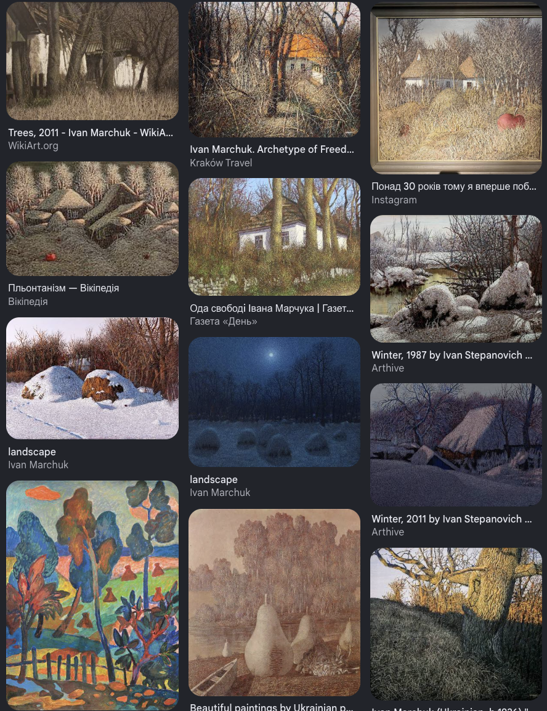
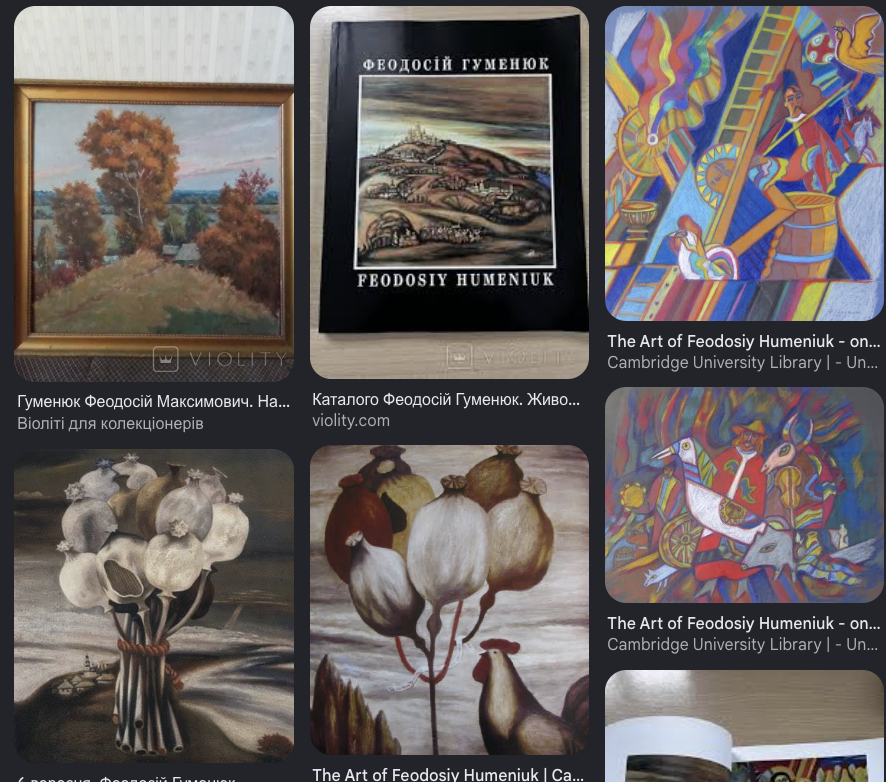

# Культурний шар — мистецький outreach pool (deferred)

Мистецький шар SilkenNet: художники, чиї роботи транслюють сирі D-MRV-цифри в людську емпатію — для Genesis-launch, pitch-візуалів та майбутніх NFT. Локальні (Черкаський бір) і національні.

> **Не канон, не hot-path.** Це outreach pool, а не операційна залежність: жоден запис не блокує merge й не лежить у критичному шляху. Активація — за TRL-тригерами (Genesis on-chain, публічний launch — далекий горизонт). Файл ненумерований і свідомо поза `NN_NN`-каноном (не публікується у wiki). Дім-стан outreach → [`00_07`](00_07_Action_Plan_Tracker) (STK.8 черкаські · STK.9 національні).

> **Legal:** будь-який NFT з прив'язкою до митця → підписаний Name & Likeness Release (юр-супровід — Аблязов, [`00_02`](00_02_Academic_Integration_and_IP)).

---

#### Микола Бабак — Концептуальний архів

- **Звання:** Народний художник України.
- **"Код":** Працює парою з дружиною Оленою Бабак ("Babak Couple") у режимі концептуальної інсталяції. Десятиліттями збирав українську старовину (рушники, ікони на склі, килими) — фактично побудував приватний етнографічний архів. Куратор українського павільйону на Венеційській бієнале.
- **Резонанс:** Концептуальне оформлення Genesis-кластера (Черкаський бір) як живого архіву спадщини.

#### Іван Бондар — Живопис та кераміка з ядра бору

- **Звання:** Народний художник України.
- **"Код":** Народився в с. Яснозір'я — у географічному центрі Черкаського бору та Ірдинського болота. Майстер кераміки + живопис.
- **Резонанс:** Керамічні "портрети" Master Nodes — фізичні RWA-артефакти токенізованих дерев.

#### Юрій Іщенко — Монументалізм як еталон спокою

- **Звання:** Заслужений художник України; пейзаж і монументалістика.
- **"Код":** Малює "великі" пейзажі Черкащини у класичній традиції.
- **Резонанс:** Монументальний візуал `IDLE State` (гармонійний ліс) для pitch-матеріалів.

#### Іван Марчук — Пльонтанізм як mesh-нерв

- **Звання:** Народний художник України; член Світової Золотої Гільдії.
- **"Код":** Винайшов **пльонтанізм** — техніку, де картина складається з десятків тисяч переплетених тонких ниток-ліній. Daily Telegraph, "100 living geniuses" (2007).
- **Резонанс:** Пльонтанізм (серія "Trees") → динамічна ШІ-інтерпретація live-телеметрії як візуальний бренд мережі.

#### Віктор Сидоренко — Час, пам'ять, монументальність

- **Звання:** Народний художник України; концептуаліст-монументаліст.
- **"Код":** Куратор українського павільйону на Венеційській бієнале 2003 з проєктом "Millstones of Time". Теми пам'яті, переходу людини крізь час.
- **Резонанс:** Монументальна скульптура Genesis-кластера з викарбуваним on-chain state-root (NFC-tag → Etherscan).

#### Любомир Медвідь — Екзистенціал болю як `PANIC_STATE` UI

- **Звання:** Народний художник України; екзистенціаліст львівської школи.
- **"Код":** Складне, часом трагічне мистецтво про межі людського існування, біль, мортальність. Глибинно філософське, не декоративне.
- **Резонанс:** Візуальна мова для рендерингу `PANIC_STATE` алертів (кавітація/chainsaw) у дашборді.

#### Феодосій Гуменюк — Холодноярський епос → Master Nodes

- **Звання:** Народний художник України; історичний живопис.
- **"Код":** Малює козаків, гетьманів, ритуали; роботи глибоко вкорінені у міфологію Холодного Яру, Суботова, Чигирина. Полотна у виданнях Cambridge University Press.
- **Резонанс:** Візуальний словник для карток Legacy Master Nodes (Холодний Яр — дуб Залізняка).

#### Михайло Гуйда — Українсько-китайський синтез → Wu-Wei

- **Звання:** Народний художник України; працює на стику української школи й китайської каліграфії.
- **"Код":** Багато років викладав і виставлявся в Китаї; поєднує українську реалістичну школу зі східною каліграфією.
- **Резонанс:** Візуалізація атрактора Лоренца + pitch азійським інвесторам (укр-китайський синтез).

#### Віктор Ковтун — Слобожанський пейзаж як baseline

- **Звання:** Народний художник України; класичний пейзаж Слобожанщини.
- **"Код":** Класичний український пейзаж у його найкращих гармонійних станах — чиста природна гармонія.
- **Резонанс:** Візуальний `IDLE State` baseline для whitepaper.
