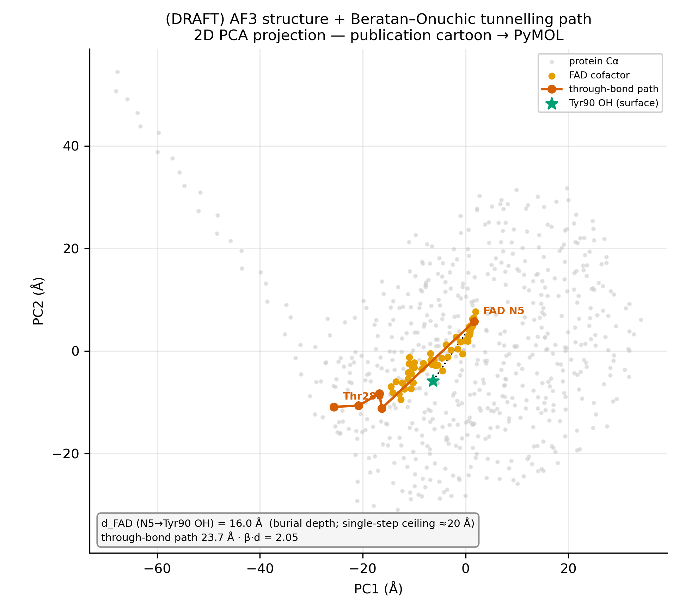
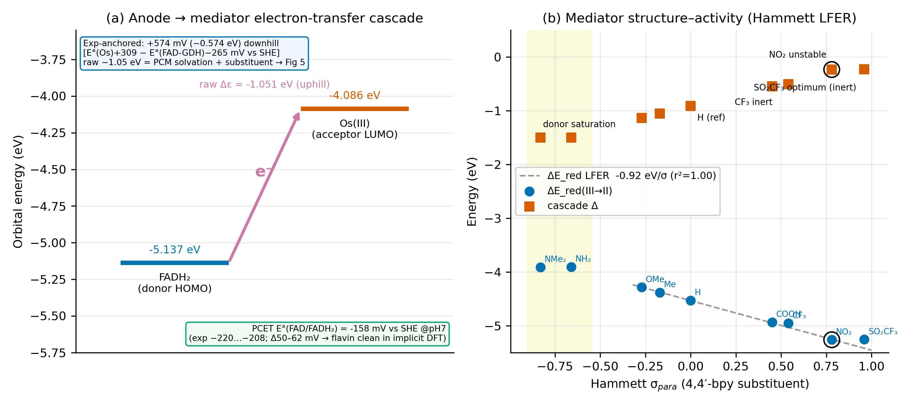
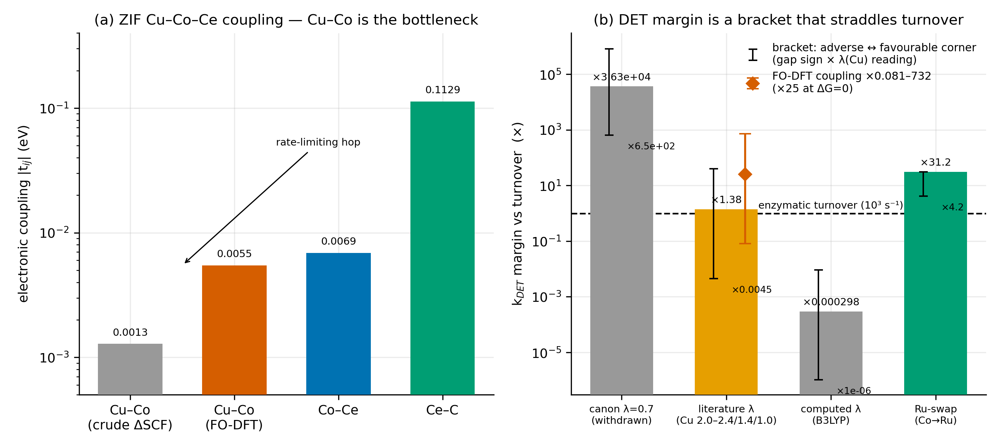
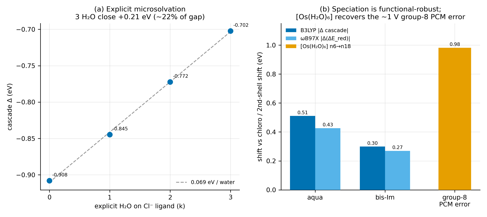
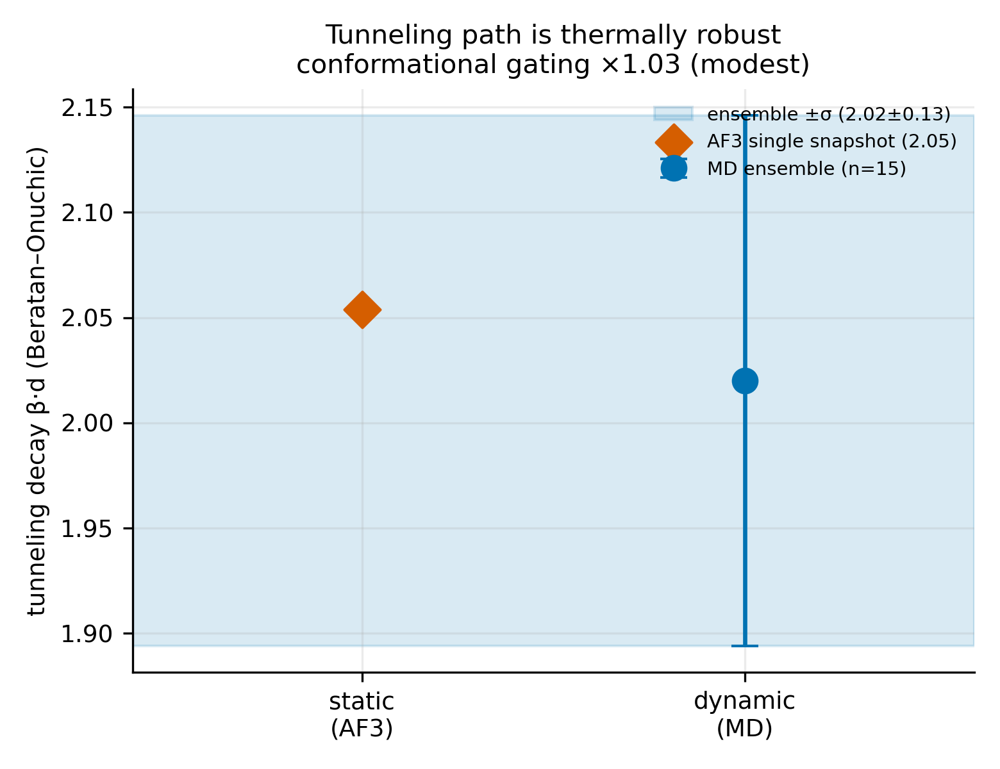

# 3. Results and Discussion — draft (Стаття 1)

> **Draft section** (prose for §3 of [`00_OUTLINE.md`](00_OUTLINE.md)). Numbers are pulled from
> [`SUMMARY.md`](../SUMMARY.md) (One-Home) at draft time — if a value changes, change SUMMARY first,
> then re-pull here. Voice: academic-formal, honest, systems-clear (see
> [`00_WRITING_GUIDE.md`](00_WRITING_GUIDE.md) §Voice). EN (J. Phys. Chem. B).

We follow the electron from the buried flavin to the external circuit — anode → mediator → cathode —
treating each step as a link whose energetics we can compute and test against experiment.

## 3.1 Architecture and the tunnelling pathway

The AlphaFold 3 model places the FAD N5 atom **16.0 Å** below the protein surface (Tyr90 OH as the
nearest exit), inside the 18–20 Å window over which biological electron tunnelling remains efficient.
A Beratan–Onuchic pathway analysis identifies a dominant through-bond route, FAD → Ala261 → Thr260 →
Thr288 (PDB residue numbering), with an effective decay **β·d = 2.05** (Fig 2) — feasible for the mediated
transfer the architecture requires. The exit residues are well-ordered in the prediction (pLDDT ≫ 80),
so the path is a structural feature, not a disordered artefact. Replayed over a 15-frame
molecular-dynamics ensemble the decay is essentially unchanged (β·d = 2.02 ± 0.13; conformational-gating
factor 1.03×), confirming that the single-structure pathway is representative of the thermal ensemble
rather than a fortuitous static geometry (Fig S1). The deglycosylated production variant (eleven N→Q
substitutions) preserves this geometry.

## 3.2 Anode PCET: the FAD redox potential

Treating the FAD/FADH₂ couple with a thermodynamic proton reference (rather than an explicit, and in
implicit solvent grossly over-stabilised, hydronium ion) recovers **E°(FAD/FADH₂) = −158 mV vs NHE** —
within ~50 mV of the experimental free-flavin value (Fig 3a). This is the paper's clean positive result: a
proton-coupled redox potential of a biological cofactor, reproduced by implicit-solvation DFT once the
proton is handled correctly. It also isolates the cascade discrepancy discussed in §3.5 to the
mediator side of the chain, not the flavin.

The inner-sphere reorganisation energy of the first anode oxidation was likewise computed, not assumed.
The naïve FADH₂/FADH₂•⁺ radical-cation is geometrically pathological in continuum solvent (it
fragments on relaxation); the physically correct, pH-7 first electron transfer is the deprotonated
**FADH⁻ → FADH• + e⁻** couple, whose Nelsen four-point analysis gives an inner-sphere **λ_i = 0.39 eV**.
Adding a Marcus two-sphere outer-sphere term brings the total to ~0.7–0.8 eV (computed λ_total
0.76–0.86 eV for a charge-delocalised, buried cofactor); this continuum estimate is, however,
radius- and dielectric-dominated, so we adopt the literature value in the rate calculations and use the
two-sphere result only to confirm that it is physically reasonable.

## 3.3 A structure–activity rule for the osmium mediator

Varying the 4,4′-bipyridine substituents across the experimental potential range gives a clean **Hammett
linear free-energy relationship**: the Os(III/II) reduction energy is linear in σ_para with slope
≈ **−0.93 eV per σ unit** (Fig 3b; Table 4), triangulated against the additive Lever E_L scheme and the measured series.
Electron-withdrawing substituents raise E°(Os) and improve the FADH₂→Os cascade alignment, giving a
predictive design handle rather than a one-off optimisation.

The rule also exposes a practical subtlety. The maximal cascade driving force is reached by strongly
electron-withdrawing groups, but the strongest (NO₂) is electrochemically **unstable** at the operating
pH (it reduces to the amine on cycling, collapsing the cascade to its worst case). The realistic
optimum is therefore the inert high-σ **SO₂CF₃** (cascade −0.227 eV, matching NO₂'s −0.232 eV but
without the degradation), with CF₃ a milder inert alternative. Crucially, the cascade-thermodynamic
optimum is *not* the cell optimum: a higher E°(Os) lowers the open-circuit voltage, so the experimental
optimum (~+309 mV) balances driving force against overpotential.

## 3.4 Direct electron transfer through the ZIF cathode

Inter-metal couplings in the bimetallic Cu–Co–Ce nanozyme were obtained from charge-localised ΔSCF on
clash-free cluster geometries (a bridging imidazole that had collided with the second metal was
deprotonated to the imidazolate, restoring physical coordination). With reorganisation energies
computed by the two-sphere Nelsen method rather than assumed, the **Cu–Co hop is the bottleneck** (Fig 4a; Table 3), and
its rate sits at **~enzymatic turnover** — a margin of order ×1–30, not the orders of magnitude an
earlier (geometry- and λ-) artefact had suggested.

A two-state FO-DFT diabatisation (Mulliken–Hush localisation of the metal-d frontier pair) confirms the
bottleneck is robust to the coupling method, not an artefact of the crude state-energy ΔSCF: it returns
t_ij(Cu–Co) = 0.0055 eV — within a factor of four of the ΔSCF value, still in the meV regime — together
with a 0.18 eV site-energy gap the crude treatment had assumed away. The resulting margin stays
borderline and parameter-sensitive (spanning ×0.6 to ×730 across the gap sign, ×25 at zero), firmly
excluding the earlier orders-of-magnitude margin.

This is a finding, not a failure, and we present it with its sensitivity. The rate depends
exponentially on λ: at the literature first-row values the Cu–Co hop is borderline (≈ ×1.4 over
turnover, Fig 4b); B3LYP over-estimates the first-row λ (the Co couple by ≈ 2×, a spin-crossover artefact),
which would push it lower; and a low-λ metal removes the limitation entirely — replacing Co by **Ru**
(computed λ 0.78 eV vs Co ≈ 3 eV) restores a ~×31 margin from the reorganisation energy alone. (We also
probed whether Ru's diffuse 4d orbitals additionally raise the coupling: at the fixed cluster geometry
both a crude ΔSCF and an FO-DFT diabatisation returned a large t_ij but failed their physicality check —
the frontier orbitals localise entirely on Ru with no copper partner, so the minimal cluster cannot form
a clean Cu↔Ru diabatic pair; that coupling advantage is therefore a hypothesis for constrained-DFT, not a
result, and the Ru lever is justified here by λ alone.) The honest reading is a borderline,
possibly co-limiting cathode whose three design levers — a low-λ metal, conductive-MOF band transport,
or an acid-stable enzyme-free single-atom catalyst — are set out and ranked by their viability at the
acidic Zone 3 (pH ≈ 4.5).

Two model caveats frame this. The coupling is computed on a clash-corrected programmatic cluster, not a
DFT-relaxed geometry — these flat-PES metal clusters resist geometry optimisation (as the osmium complex
did), so t_ij is geometry-bounded. And the single-hop bottleneck is a conservative estimate: the ZIF is
a wide-gap insulator, so charge transport proceeds by the discrete Marcus hops we model rather than band
conduction, and the 3D framework presents parallel instances of the bottleneck hop — genuine band-like
transport would require a conductive MOF (one of the levers above). A predicted cathode
charge-transfer resistance is correspondingly uncertain: with the borderline DET rate and the unknown
nanozyme site coverage, a surface-confined (Laviron) estimate spans ~0.002–230 Ω — the cathode arc could
be negligible or comparable to the anode's, so it cannot be fixed a priori, and the kinetic competition
(rather than a single R_ct) is the robust description. The cathode EIS of the forthcoming Ti-coin
experiment is the decisive empirical test.

## 3.5 The cascade and the limits of implicit solvation

The raw computed cascade FADH₂→Os is **unfavourable in every method** (Table 2) — the frontier-orbital alignment
is inverted (a Koopmans HOMO−LUMO offset of −1.05 eV on the real 4,4′-dimethyl-bpy mediator, the donor level
*below* the acceptor) and the adiabatic ΔSCF free energy is uphill (+0.88 eV for the plain-bpy reference; the
dimethyl recompute widens it by the substituent term below) — whereas the **experimentally verified** driving force
is **downhill** (+574 mV, −0.574 eV; from the verified bound FAD-GDH potential, §3.6, and the device osmium-polymer
potential **+309 mV vs NHE** — the best-performing of six polymers wired to GcGDH, measured as +21 mV vs
Ag/AgCl(0.1 M KCl) with the paper's +288 mV conversion [Zafar et al., 2012]). (The orbital offset and the free
energy are distinct quantities, so their signs are not directly comparable; both nonetheless point the "wrong" way
against experiment.) The discrepancy between the ΔSCF free energy and the verified value is the paper's
methodological core, and we decompose rather than excuse it.

The real mediator is the **chloro** complex [Os(4,4′-dimethyl-bpy)₂(PVI)Cl]⁺ (Zafar), so the DFT chloro model is
structurally correct and the gap is a **differential-solvation bracket** plus a substituent term (Fig 5).
Differential solvation of the charge-changing octahedral couple is the dominant axis: the as-synthesised **chloro
(+1/+2)** couple closes +0.21 eV with three explicit chloride-shell waters — the **lower bracket**, since the anionic
chloride lowers the couple charge and its continuum error is ≈5× smaller than the benchmark — while in the operating
poly(vinylimidazole) brush the sixth ligand may instead be a second chain imidazole, the PVI-realistic
**bis-imidazole (+2/+3)** form, which closes **+0.55 eV** (the **upper bracket**; aquation is unlikely on the
substitution-inert Os(II) d⁶ couple, so the earlier "the experiment measures the aqua form" framing is withdrawn —
aqua serves only as a methodological benchmark). The [Os(H₂O)₆]³⁺/²⁺ benchmark fixes the +2/+3 scale: adding the
second hydration shell shifts the potential by **+0.98 eV**, reproducing the known ~1 V group-8 implicit-solvation
error. A second, smaller axis is the **4,4′-dimethyl substituent** itself (+0.146 eV more uphill than plain bpy — the
donor methyls raise the Os(III) acceptor level, consistent with the Hammett series ①). Crucially, none of these
contributions is tuned to the anchored cascade — the solvation term is benchmarked on a *separate* couple and the
substituent term follows from the structure–activity series — so the discrepancy is decomposed independently rather
than absorbed into a fitted correction. The residual is thus a quantified, transferable limitation of continuum
solvent on charged transition-metal redox couples — not a chemistry problem — whose rigorous closure is
explicit-water QM/MM of the **chloro** species.

## 3.6 The protein environment on the FAD potential

The bound enzyme potential is **E°(FAD-GDH) = −265 mV vs SHE** (an experimentally verified value); the
protein shifts the cofactor from the free-flavin −208 mV to a more negative −265 mV, i.e. makes FAD a
*better* electron donor and enlarges the cascade driving force — a mechanistic gain, not a gap. An
active-site cluster (isoalloxazine plus the catalytic His537, the charged Glu61 and the backbone amide
contacts within ~5 Å) is defined from the AF3 structure; the rigorous QM-cluster potential, sensitive
to His/Glu protonation, is reserved for the explicit-solvent QM/MM capstone.

## 3.7 Thermal robustness (brief)

Across a molecular-dynamics ensemble the FAD frontier orbital is thermally stable (HOMO −5.59 ± 0.06 eV,
σ ≪ 0.3 eV), so the single-geometry redox energetics above are representative of the room-temperature
ensemble rather than of one fortuitous snapshot.

---

> **Tables T1–T4** (levels of theory · cascade energetics all-methods · DET hops+λ · mediator series)
> are collected in [`06_tables.md`](06_tables.md), generated from the cache by
> [`61_paper_tables.py`](../../../../tools/in_silico/scripts/61_paper_tables.py) (drift-safe, canon-asserted).

## Figures

> Data-driven figures are generated deterministically from the cached DFT results by
> [`tools/in_silico/scripts/60_paper_figures.py`](../../../../tools/in_silico/scripts/60_paper_figures.py)
> (reads `cache/dft/*.json` only — no DFT recompute; every headline number is asserted against
> [`SUMMARY.md`](../SUMMARY.md) at build time). Re-run: `mamba run -n silken_md python tools/in_silico/scripts/60_paper_figures.py`.
> **Fig 2** has a **DRAFT** below (a 2D PCA projection of the AF3 coordinates, generated by the same
> script); a *publication cartoon* still wants PyMOL/ChimeraX on `dgrGcGDH_AF3.pdb`. **Still pending
> (not cache-derivable → illustration pass):** **Fig 1** graphical abstract (cascade over the 3-zone
> gyroid anchor — new art).

**Figure 2 (DRAFT). AF3 architecture and the tunnelling pathway.** 2D PCA projection of the 600-Cα
envelope (grey) with the FAD cofactor (orange) and the Beratan–Onuchic through-bond route
FAD N5 → Ala261 → Thr260 → Thr283 → Thr288 (red); Tyr90 OH marks the nearest surface exit. The flavin
N5 sits **16.0 Å** below the surface — within the 18–20 Å tunnelling window — and the through-bond path
(23.7 Å) gives β·d = 2.05. *A 2D projection flattens the burial depth; the publication-grade cartoon
(PyMOL) is the companion to this draft.*

**Figure 3. Anode→mediator electron-transfer energetics.** *(a)* Frontier-orbital cascade for the
rate-determining FADH₂→Os(III) step (B3LYP/6-31G(d)+LANL2DZ(Os)/C-PCM). The raw frontier-orbital offset
is uphill (Δε = −1.05 eV on the dimethyl mediator) and the adiabatic ΔSCF free energy is +0.88 eV (plain-bpy
reference), whereas the verified driving force is downhill (+574 mV / −0.574 eV, from E°(Os) **+309 mV vs NHE**
[the device 4,4′-dimethyl-bpy Os-PVI polymer, Zafar 2012] and the verified bound E°(FAD-GDH) −265 mV vs SHE); the
raw inversion is the PCM-solvation + 4,4′-dimethyl-substituent artefact decomposed in Fig 5. The
proton-referenced flavin potential, E°(FAD/FADH₂) = −158 mV vs SHE at pH 7, lies within 50 mV of
experiment (−208 mV). *(b)* Hammett structure–activity relationship for cis-[Os(4,4′-X-bpy)₂(1-MeIm)Cl]⁺/²⁺
at constant charge: ΔE_red(III→II) is linear in σ_para (slope −0.92 eV/σ, r² = 1.00; fit over the
OMe→NO₂ regime), with donor-resonance saturation at NMe₂/NH₂. Electron-withdrawing substituents raise the
cascade driving force; the realistic optimum is the electrochemically inert SO₂CF₃ (NO₂ degrades on
cycling).

**Figure 4. Direct electron transfer through the bimetallic Cu–Co–Ce ZIF cathode.** *(a)* Inter-metal
electronic couplings |t_ij| (log scale) from charge-localised ΔSCF on clash-free cluster geometries; the
Cu–Co hop is the bottleneck, confirmed by a two-state FO-DFT Mulliken–Hush diabatisation (0.0055 eV,
~4× the crude ΔSCF value). *(b)* Marcus k_DET margin of the Cu–Co bottleneck relative to enzymatic
turnover (10³ s⁻¹, dashed) across reorganisation-energy scenarios; at literature first-row λ the margin is
borderline (×1.4). The FO-DFT range (×0.6–732 across the ΔG sign, ×25 at ΔG = 0) brackets the rigorous
result; the earlier ×10⁵ margin (broken geometry + assumed λ = 0.7 eV — "canon λ=0.7") is withdrawn. A
low-λ metal (Co→Ru, computed λ 0.78 eV) restores a ~×31 margin.

**Figure 5. The cascade gap decomposes into a chloro↔bis-Im differential-solvation bracket plus a substituent
term** (the "limits of implicit solvation" result). *(a)* Adding explicit waters to the chloride of the real
(chloro) dimethyl mediator monotonically closes the gap (+0.21 eV / three waters) — the **+1/+2 lower bracket**
(the anionic Cl⁻ lowers the couple charge, so its continuum error is ≈5× smaller than the benchmark). *(b)* In the
operating PVI brush the sixth ligand may be a second chain imidazole — the PVI-realistic **bis-imidazole (+2/+3)
upper bracket** (+0.55 eV vs chloro at B3LYP, +0.27 eV at ωB97X). Both +2/+3 forms (aqua, +0.49 eV, a
methodological benchmark) lie above chloro at **both** functionals — the chloro↔+2/+3 bracket is functional-robust;
only the internal aqua↔bis-Im order is functional-sensitive (B3LYP bis-Im > aqua, ωB97X aqua > bis-Im, ≤0.15 eV). The [Os(H₂O)₆]³⁺/²⁺ benchmark fixes the +2/+3 scale — the second-shell shift
of **+0.98 eV** reproduces the known ~1 V group-8 implicit-solvation error.

**Figure S1. Thermal robustness of the tunnelling pathway.** The Beratan–Onuchic decay β·d from the
single AlphaFold-3 snapshot (2.05) agrees with the molecular-dynamics ensemble mean (2.02 ± 0.13, n = 15
frames); the conformational-gating factor is a modest ×1.03, so the static-structure pathway is
representative of the thermal ensemble (supports §3.1; the Fig 2 structural render is the companion).
